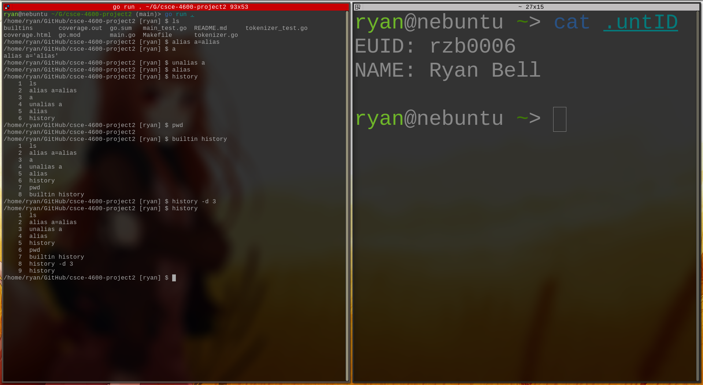

# Project 2: Shell Builtins

## Description

For this project we'll be adding commands to a simple shell. 

The shell is already written, but you will choose five (5) shell builtins (or shell-adjacent) commands to rewrite into Go, and integrate into the Go shell.

There are many builtins or shell-adjacent commands to pick from: 
[Bourne Shell Builtins](https://www.gnu.org/software/bash/manual/html_node/Bourne-Shell-Builtins.html), 
[Bash Builtins](https://www.gnu.org/software/bash/manual/html_node/Bash-Builtins.html,), and 
[Built-in csh and tcsh Commands](https://docstore.mik.ua/orelly/linux/lnut/ch08_09.htm).

Feel free to pick from `sh`, `bash`, `csh`, `tcsh`, `ksh` or `zsh` builtins... or if you have something else in mind, ping me and we'll work it out.

As an example, two shell builtins have already been added to the package builtins:

- `cd`
- `env`

## Commands

I implemented the following commands:

Command   | Reference
----------|---------------------------------------------------------------------
`alias`   | https://www.gnu.org/software/bash/manual/html_node/Bash-Builtins.html#index-alias
`builtin` | https://www.gnu.org/software/bash/manual/html_node/Bash-Builtins.html#index-builtin
`history` | https://www.gnu.org/software/bash/manual/html_node/Bash-History-Builtins.html#index-history
`pwd`     | https://www.gnu.org/software/bash/manual/html_node/Bourne-Shell-Builtins.html#index-pwd
`unalias` | https://www.gnu.org/software/bash/manual/html_node/Bash-Builtins.html#index-unalias

They're alright I guess.